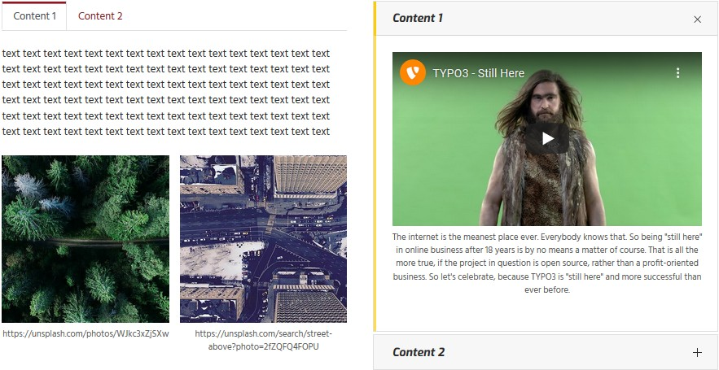
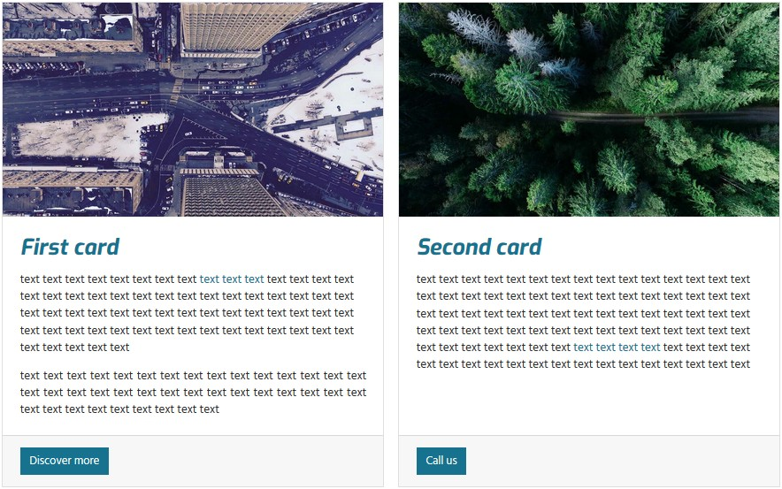

.. include:: ../Includes.txt

.. _introduction:

============
Introduction
============

.. note::

   This extension is further maintained by community support. Please contact the `author <mailto:info@buechler.pro>`__
   if you are interested in further development and bug fixes on a commercial basis.

   As an alternative the extension `container_elements <https://github.com/buepro/typo3-container_elements>`__
   could be used. It provides similar functionality using `container <https://github.com/b13/container>`__.

What it does
============

This extension provides elements to further structure the content area. It is powered by the
`extension gridelements <https://extensions.typo3.org/extension/gridelements/>`__. Many thanks to the
"Grid Elements Team"!

Currently the following elements are available: container, columns, registers, accordion, tile unit and card. The
extension is intended to be used together with the `bootstrap framework <https://getbootstrap.com/>`__.

Since the elements are provided by `gridelements <https://extensions.typo3.org/extension/gridelements>`__ they are
following referred to as grid elements.

Grid elements can hold any kind of content elements hence as well other grid elements.

Example contents
================

Columns, tabs and accordion
---------------------------

The following image shows the usage from a two columns grid element containing a tabs grid element in the left column
and an accordion grid element in the right column. Three and four columns grid elements are available too.

Container and cards
-------------------

The container grid element adds freedom in designing the layout. It might be used to group elements as well as to
enhance the functionality. In the below shown image the `Container classes` field from the grid element `container` has
been set to `card-deck` and accommodates two card grid elements.

Tile unit
---------

The tile unit grid element can be used to create panels showing tiles.

Tiles aren't yet supported by the bootstrap framework hence on bare installations won't show up as expected. To get
started using tile units the `extension pizpalue <https://extensions.typo3.org/extension/pizpalue>`__ might be
checked out.

.. figure:: ../Images/Introduction/TileUnit.jpg
   :alt: Tile unit containing tile content elements

