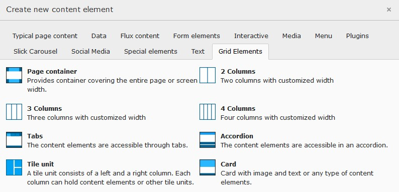
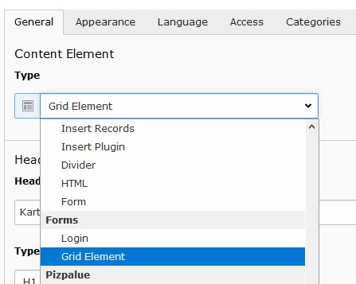
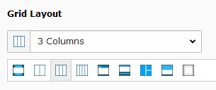
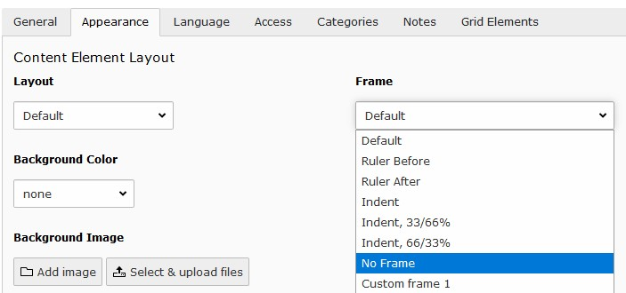

.. include:: ../Includes.txt

.. _user_use_elements:

=================
Use grid elements
=================

New content element wizard
==========================

Grid elements can be added by the new content element wizard. The available elements can be found under the register
`Grid elements`.

   Grid elements are available under the "Grid Elements" tab in new content element wizard

Content element type
====================

When changing a content element type the grid elements are available after selecting `Grid Element`.

   "Grid Element" in content element type selector

-----------------------------------------------------------------------------------------------------------------------

   Available grid elements

Vertical spacing
================

Sometimes structure elements are rendered with excessive vertical spacing. To reduce them `No Frame` might be
selected by the frame selector under the `Appearance`-tab.

   Select the appropriate frame to adjust vertical spacing
