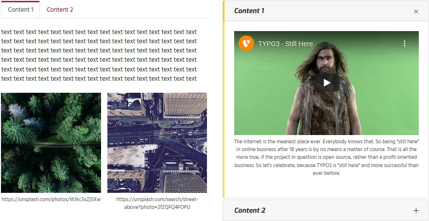
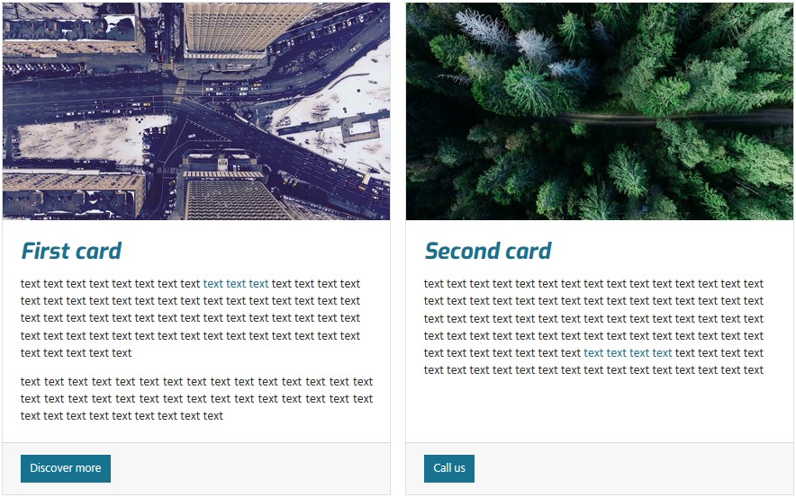
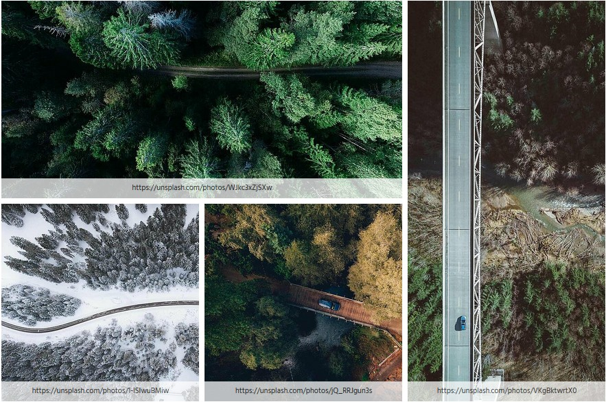

# TYPO3 pp_gridelements

This [TYPO3](https://typo3.org/) extension provides elements to further structure the content area. It is powered
by the [extension gridelements](https://extensions.typo3.org/extension/gridelements/). Many thanks to the 
"Grid Elements Team"!

Currently the following elements are available: container, columns, registers, accordion, tile unit and card.

The extension is intended to be used together with the [bootstrap framework](https://getbootstrap.com/).

## Example contents

### Columns, tabs and accordion

The following image shows the usage from a two columns element containing a tabs element in the left column
and an accordion element in the right column. Three and four columns elements are available too.

### Container and cards

The container element adds freedom in designing the layout. It might be used to group elements as well as to
enhance the functionality. In the below shown image the `Container classes` field from the container element has
been set to `card-deck` and accommodates two card elements.

### Tile unit

The tile unit element can be used to create panels showing tiles.

Tiles are not yet supported by the bootstrap framework hence on bare installations won't show up as expected. To get
started using tile units the [distribution pizpalue](https://extensions.typo3.org/extension/pizpalue) might be
checked out.

## Resources

- [Documentation from this extension](https://docs.typo3.org/p/buepro/typo3-pp_gridelements/master/en-us/)
- [Extension at the TYPO3 extension repository](https://extensions.typo3.org/extension/pp_gridelements/)
- [TYPO3 distribution `pizpalue`](https://extensions.typo3.org/extension/pizpalue/) supports tile units.
- [Documentation from extension `gridelements`](https://docs.typo3.org/typo3cms/extensions/gridelements/stable/)
